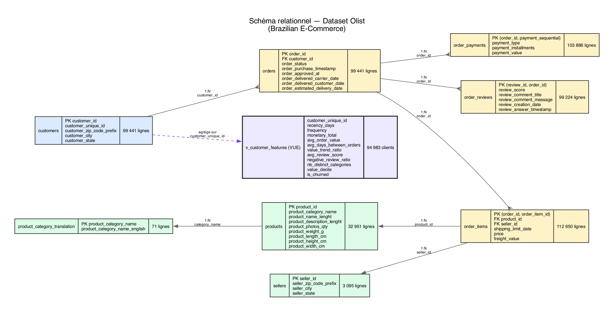

# SQL Avancé : Feature Engineering pour la Prédiction de Churn Client

Ce projet a pour objectif de construire un pipeline de feature engineering complet et performant en SQL pur, destiné à alimenter un modèle de Machine Learning pour la prédiction du churn des clients de la marketplace brésilienne Olist.

Le livrable principal est une vue analytique `v_customer_features`, qui transforme les données brutes de transactions en un ensemble de features comportementales pour chaque client.

## Contexte du Projet

Face à un taux de churn élevé, l'équipe data science d'Olist a besoin d'identifier les clients à risque pour lancer des campagnes de rétention ciblées. Ce projet structure, nettoie et enrichit les données pour répondre à la question : **"Quels clients vont churner dans les 90 prochains jours, et quels signaux comportementaux les distinguent ?"**

## Technologies

*   **Base de données :** PostgreSQL
*   **Langage :** SQL (DDL, DML, DQL)
*   **Concepts clés :** CTEs, Window Functions, Agrégations avancées, Optimisation de requêtes, Indexation.

## Livrables

*   `01-schema.sql` — création du schéma relationnel et des tables.
*   `02-import.sql` — import des CSV dans les tables.
*   `03-nettoyage.sql` — nettoyage et traitement des anomalies.
*   `04-features.sql` — requêtes de feature engineering documentées.
*   `05-vue-finale.sql` — création de la vue analytique `v_customer_features`.
*   `06-optimisation.sql` — création des index et notes d'optimisation.

---

## Phase 1 : Prérequis et Installation (Windows)

Avant d'exécuter le projet, il faut s'assurer que PostgreSQL est correctement installé et configuré.

### 1. Installer PostgreSQL

1.  **Télécharger l'installeur** depuis le site officiel : PostgreSQL via EDB. Choisir la version la plus récente pour Windows.
2.  **Lancer l'installation** et suivre les étapes. Points d'attention :
    *   **Composants :** Laisser les composants par défaut cochés (`PostgreSQL Server`, `pgAdmin`, `Stack Builder` et `Command Line Tools`).
    *   **Mot de passe :** Définir un mot de passe pour le super-utilisateur `postgres`. **Il est important de le noter, il sera demandé constamment.**
    *   **Port :** L'installeur propose le port `5432` par défaut. Il est possible de le laisser ou de le changer (par exemple, en `5433` si le port 5432 est déjà utilisé). Ce guide utilise `5433`.

### 2. Configurer la Variable d'Environnement

Pour pouvoir utiliser les commandes `psql`, `createdb`, etc., depuis n'importe quel dossier dans le terminal, il faut ajouter le dossier `bin` de PostgreSQL au `PATH` système.

1.  Ouvrir le menu Démarrer et rechercher "Modifier les variables d'environnement pour le compte utilisateur".
2.  Dans la fenêtre qui s'ouvre, cliquer sur le bouton "Variables d'environnement...".
3.  Dans la section "Variables système", trouver la variable `Path` et cliquer sur "Modifier...".
4.  Cliquer sur "Nouveau" et ajouter le chemin vers le dossier `bin` de l'installation PostgreSQL. Par défaut, ce sera quelque chose comme :
    `C:\Program Files\PostgreSQL\16\bin`
    *(Adapter le numéro de version `16`à la version installée).*
5.  Cliquer sur "OK" pour fermer toutes les fenêtres.
6.  **Important :** Fermer et rouvrir tous les terminaux (PowerShell, CMD) pour que la modification soit prise en compte.

### 3. Vérifier l'installation

Ouvrir un nouveau terminal PowerShell et taper la commande suivante :

```sh
psql --version
```

Si l'installation et la variable d'environnement sont correctes, vous devriez voir la version de `psql` s'afficher (ex: `psql (PostgreSQL) 16.0`).

### 4. Télécharger le Dataset

Ce projet utilise le dataset public "Brazilian E-Commerce" d'Olist.

1.  **Télécharger les données** depuis Kaggle : Brazilian E-Commerce Public Dataset by Olist.
2.  **Décompresser l'archive** `olist_public_dataset_v2.zip` (ou nom similaire).
3.  **Placer les 8 fichiers CSV** résultants dans le dossier `Data/` à la racine de ce projet. Le script d'importation est déjà configuré pour lire les fichiers depuis cet emplacement.

---

## Phase 2 : Construction de la Base de Données

Les commandes suivantes doivent être exécutées depuis un terminal **PowerShell** à la racine de votre projet.

1.  **Naviguer jusqu'au dossier du projet :** (Adapter le chemin)
    ```powershell
    cd chemin/vers/le/projet/Pr-diction-de-Churn-Client
    ```

2.  **Exécuter la séquence de scripts :**
    Ce bloc de commandes va recréer la base de données, créer les tables, importer les données, les nettoyer, créer la vue finale et appliquer les optimisations.

    > Remplacer`postgres` par le vrai nom d’utilisateur PostgreSQL 

    ```powershell
    # Supprime la base de données si elle existe pour un départ propre
    dropdb -p 5433 -U postgres --if-exists olist_db

    # Crée une nouvelle base de données vide (encodage WIN1252 pour Windows)
    createdb -p 5433 -U postgres olist_db

    # 1. Crée la structure des tables
    psql -p 5433 -U postgres -d olist_db -f 01-schema.sql

    # 2. Importe les données depuis les fichiers CSV
    psql -p 5433 -U postgres -d olist_db -f 02-import.sql

    # 3. Applique les corrections de nettoyage
    psql -p 5433 -U postgres -d olist_db -f 03-nettoyage.sql

    # 4. Crée la vue analytique finale (le script 04-features.sql est pour la documentation)
    psql -p 5433 -U postgres -d olist_db -f 05-vue-finale.sql

    # 5. Crée les index pour optimiser les performances
    psql -p 5433 -U postgres -d olist_db -f 06-optimisation.sql

    # 6. (Optionnel) Mesure l'impact des index via EXPLAIN ANALYZE
    psql -p 5433 -U postgres -d olist_db -c "EXPLAIN ANALYZE SELECT * FROM v_customer_features;"
    ```

---

## Phase 3 : Vérification du Résultat

**Option 1 : Commande rapide**

Exécuter cette commande directement dans PowerShell pour voir les 10 clients ayant le plus dépensé :

```powershell
psql -p 5433 -U postgres -d olist_db -c "SELECT * FROM v_customer_features ORDER BY monetary_total DESC LIMIT 10;"
```

**Option 2 : Mode interactif**

1.  Connectez-vous à la base de données :
    ```powershell
    psql -p 5433 -U postgres -d olist_db
    ```
2.  Une fois connecté (l'invite devient `olist_db=#`), exécutez votre requête :
    ```sql
    SELECT * FROM v_customer_features LIMIT 10;
    ```

## Schéma de la Base de Données

Le schéma relationnel ci-dessous illustre la structure des données et les jointures utilisées pour construire la vue finale. La vue `v_customer_features` agrège les informations au niveau du `customer_unique_id`.




## Features Construites

La vue `v_customer_features` contient les colonnes suivantes pour chaque `customer_unique_id` :

| Feature                 | Description                                                                 | Utilité pour le Churn                                           |
| ----------------------- | --------------------------------------------------------------------------- | --------------------------------------------------------------- |
| `recency_days`          | Jours depuis la dernière commande.                                          | Un client inactif depuis longtemps est un client à risque.      |
| `frequency`             | Nombre total de commandes livrées.                                          | Un client fidèle commande plus souvent.                         |
| `monetary_total`        | Montant total dépensé (prix + fret).                                        | Identifie les clients à haute valeur.                           |
| `monetary_avg_basket`   | Panier moyen par commande.                                                  | Reflète le comportement d'achat typique.                        |
| `avg_review_score`      | Score moyen des avis laissés par le client.                                 | Un client insatisfait est plus susceptible de partir.           |
| `negative_review_ratio` | Pourcentage d'avis négatifs (score ≤ 2).                                    | Signal fort d'insatisfaction et de risque de churn.             |
| `nb_distinct_categories`| Nombre de catégories de produits distinctes achetées.                       | Un client diversifié est potentiellement plus engagé.           |
| `avg_days_between_orders`| Délai moyen en jours entre deux commandes consécutives.                     | Une augmentation de ce délai peut signaler un désengagement.    |


## Optimisation

L'analyse de performance via `EXPLAIN ANALYZE` a révélé des `Sequential Scans` coûteux sur les tables volumineuses. La création d'index sur les clés étrangères (`customer_id`, `order_id`, etc.) et les colonnes de filtre (`order_status`) a permis de remplacer ces opérations par des `Index Scans` beaucoup plus efficaces, réduisant drastiquement le temps d'exécution de la requête de la vue.